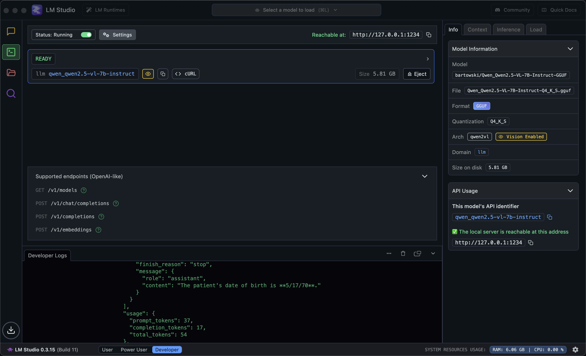

# VLM Tests


#### granite3.2-vision:2b

```bash
export API_KEY=none
export INFERENCE_SERVER=http://localhost:11434/v1
export MODEL_NAME=granite3.2-vision:2b-fp16
```

#### llama3.2-vision:11b

```bash
export API_KEY=none
export INFERENCE_SERVER=http://localhost:11434/v1
export MODEL_NAME=llama3.2-vision:11b
```


#### qwen2.5-vl-7b-instruct

From OCP, RHOAI, RAG Kickstart

```bash
oc get services -l serving.kserve.io/inferenceservice=qwen25-vl-7b-instruct-fp8-dynamic

oc expose service qwen25-vl-7b-instruct-fp8-dynamic-predictor

URL=$(oc get route -l serving.kserve.io/inferenceservice=qwen25-vl-7b-instruct-fp8-dynamic -o json | jq -r '"http://" + .items[0].status.ingress[0].host')
```

Use this script to get the official/proper/real name of the model 

```bash
export API_KEY=none

curl -s $URL/v1/models \
  -H "Authorization: Bearer $API_KEY" \
  -H "Content-Type: application/json" | jq -r '.data[0].id'

MODEL_NAME=$(curl -s $URL/v1/models \
  -H "Authorization: Bearer $API_KEY" \
  -H "Content-Type: application/json" | jq -r '.data[0].id')  
```

Test chat completions

```bash
curl -sS $URL/v1/chat/completions \
  -H "Content-Type: application/json" \
  -H "Authorization: Bearer $API_KEY" \
  -d "{
     \"model\": \"$MODEL_NAME\",
     \"messages\": [{\"role\": \"user\", \"content\": \"Hello\"}],
     \"temperature\": 0.0
   }" | jq -r '.choices[0].message.content'
```


```bash

export INFERENCE_SERVER=$URL/v1

source .venv/bin/activate

python 4-patient-intake-2.py
```


via **LM Studio** on port 1234

```bash
export API_KEY=none
export INFERENCE_SERVER=http://127.0.0.1:1234/v1
export MODEL_NAME=qwen_qwen2.5-vl-7b-instruct
```




